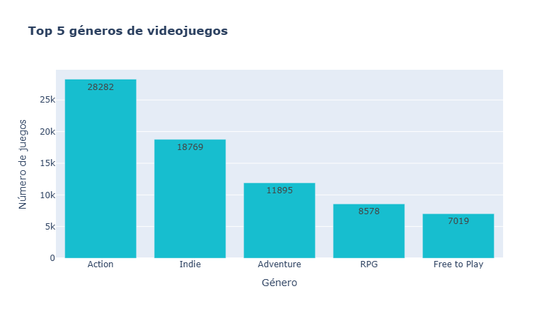
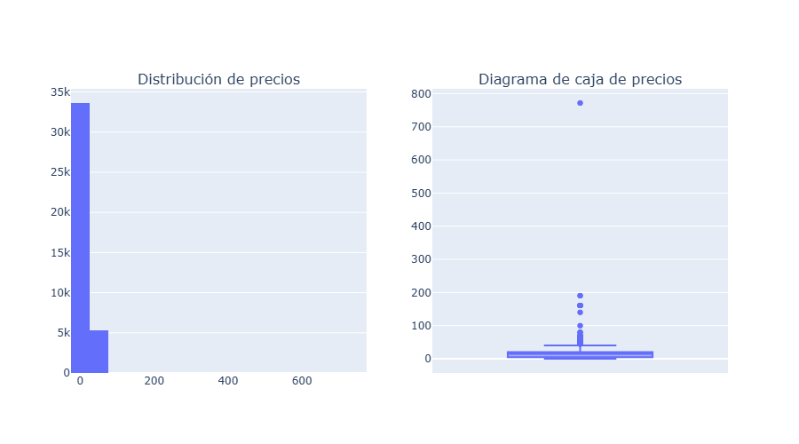
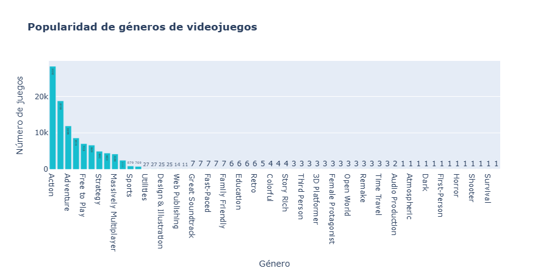
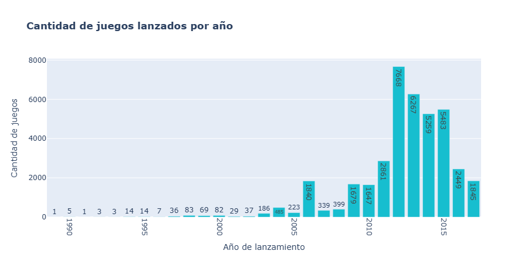
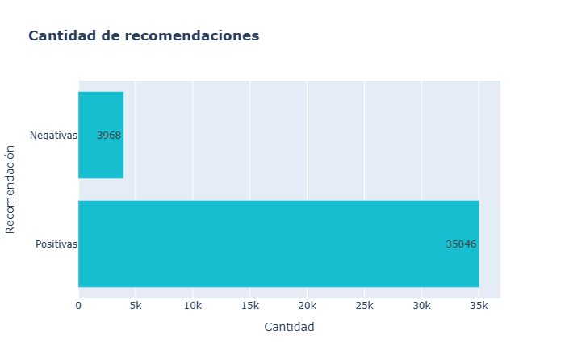
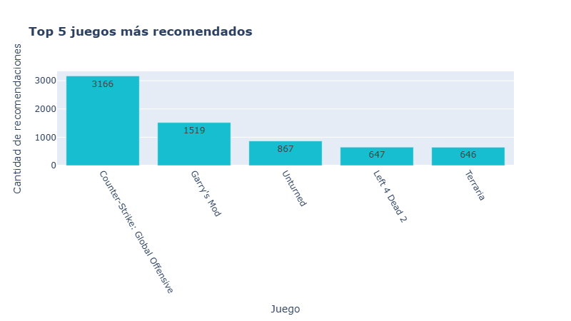
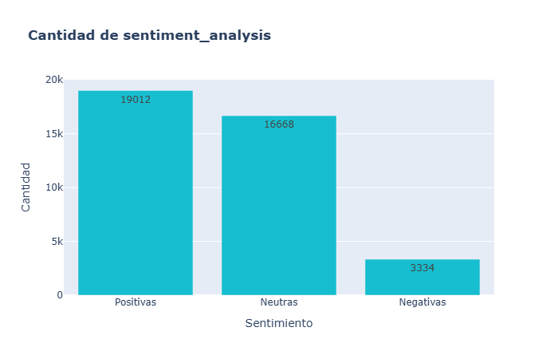
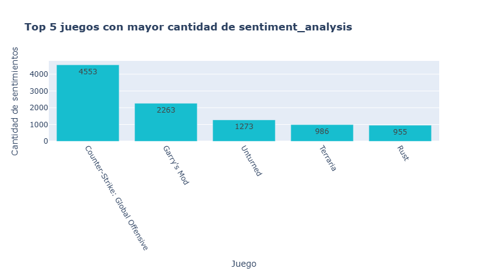

# MLOps-Data-Engineer-Machine-Learning
El objetivo del proyecto es realizar un sistema de recomendacion de videojuegos a usuarios.

En este proyecto se lleva acabo un estudio basado en Machine Learning Operations (MLOps).Este estudio se divide en tres etapas principales : 

---

1. **Exploración y Transformación:** Se realizará un análisis exploratorio de los datos, incluyendo la exploración de distribuciones y detección de correlaciones y valores atípicos.

2. **Preparación de Datos:** Se prepararán los datos para comprender las relaciones entre las variables y construir modelos sobre ellos. También se crearán funciones para consultas a los datos, consumibles a través de una API.

3. **Modelado:** Se desarrollarán modelos de Machine Learning para entender relaciones y predecir correlaciones entre variables.

Los datos utilizados incluyen información sobre juegos en la plataforma Steam y la interacción de los usuarios con estos juegos.

---
## Índice
1. [ETL](#etl)
2. [Desarrollo API](#api)
3. [Análisis exploratorio de los datos](#eda)
4. [Modelo de Aprendizaje Automático](#ml)
5. [Video](#video)
6. [Contacto](#contacto)
---
## <a name="etl">Exploración, Transformación y Carga (ETL)</a>

A partir de los 3 dataset proporcionados (`steam_games, user_reviews y user_items`) referentes a la plataforma de Steam, en primera instancia se realizó el proceso de limpieza de los datos.

#### `steam_games` [(ETL_Steam_Games.ipynb)](https://github.com/Linares-Augusto/MLOps-Data-Engineer-Machine-Learning/blob/main/ETL-EDA/ETL_Steam_Games.ipynb)
- Se eliminaron filas completamente nulas y se procede a analizar cada columna.  
- Se da prioridad a ciertas columnas que se consideran relevantes para el desarrollo de la API, estas incluyen: `id, genres, price, release date y developer`.
- En la columna **"id"** se realiza la eliminación de valores nulos , duplicados y Cambio del tipo de dato a INT.
- En la columna **"genres"** se realiza el tratamiento de valores nulos. Se utiliza la información de la columna "tags" para rellenar los nulos en "genres" y los demas valores nulos son eliminados 
- En la columna **"price"** se identifican los valores unicos estableciendo en 0.0 los valores nulos y aquellos que corresponden a juegos con "tags" o género "Free to Play". También se ajustan a 0.0 los que tienen 
  valores como "Free," "Demo," "Play" e "Install".Se eliminan tambien los datos nulos y se redondea los valores a 2 decimales. 
- En la columna "release date" Se busca obtener únicamente el año de lanzamiento ya que presenta diferentes formatos de fecha , para ello se procesa cada tipo de formato de fecha para extraer el año.
  Los datos datos nulos y aquellos que no tienen un formato de fecha válido se eliminan.
- Por ultimo se verifica que no queden valores vacios en las columnas procesadas y se eliminan el resto de columnas no utilizadas.
- Se exporta los datos en un formato JSON comprimido en gzip.

#### `user_reviews` [(ETL_user_reviews.ipynb)](https://github.com/Linares-Augusto/MLOps-Data-Engineer-Machine-Learning/blob/main/ETL-EDA/ETL_User_Reviews.ipynb)
- Se eliminan valores duplicados antes de comenzar la tranformacion .
- Se realiza la transformacion de datos separando todas las reviews y se genera una fila por cada review dentro de la columna "reviews", donde cada elemento contiene múltiples reviews del mismo usuario. Estas 
   se concatenan para facilitar su procesamiento.
- Se eliminaron filas con valores nulos,considerándolos como datos irrelevantes.
- Se crea la columna `"sentiment_analysis"` utilizando la librería nltk, que incluye la herramienta Sentiment Vader, un modelo entrenado para puntuar un texto como positivo, neutro o negativo.
- El análisis produce un diccionario de la forma {'neg': valor, 'neu': valor, 'pos': valor, 'compound': valor}. El valor "compound" representa la puntuación total de la oración compuesta, con un rango entre -1 y 1.
- Se utiliza la puntuación "compound" para categorizar la review como negativa (si x < -0.5), neutra (-0.5 >= x <= 0.5) o positiva (si x > 0.5). Luego se redondea a un valor entero (-1, 0, 1).
- Además, se suma 1 a ese valor para obtener la referencia pedida en el ejercicio (malo 0, neutro 1, positivo 2).
- Por último se verifican las columnas procesadas y se elimina la columna "review" antes de exportar los datos en un formato JSON comprimido en gzip.

#### `user_items` [(ETL_user_items.ipynb)](https://github.com/Linares-Augusto/MLOps-Data-Engineer-Machine-Learning/blob/main/ETL-EDA/ETL_users_items_ETL.ipynb) 
- En este cuaderno Jupyter, se lleva a cabo el procesamiento de datos para el conjunto de datos de los items que posee cada usuario.
- Este proceso de ETL es el más breve, ya que se centra en eliminar columnas innecesarias para el desarrollo de la API. Los datos procesados se exportan en un archivo CSV comprimido en formato gzip.

## <a name="eda">Análisis exploratorio de los datos [(EDA_Datasets.ipynb)](https://github.com/Linares-Augusto/MLOps-Data-Engineer-Machine-Learning/blob/main/ETL-EDA/EDA_Datasets.ipynb)</a>

### Top 5 juego con mas horas jugadas (playtime_forever)

- Podemos observar los 5 juegos con mas horas jugadas por todos los usuarios.
### Analisis de price

- Podemos observar que la mayoria de los juegos son gratis, y hay algunos outliers que decido mantenerlos.
### Analisis de generos

### Cantidad de juegos lanzados por año

### Analisis de recommend

### Analisis de sentiment_analysis

